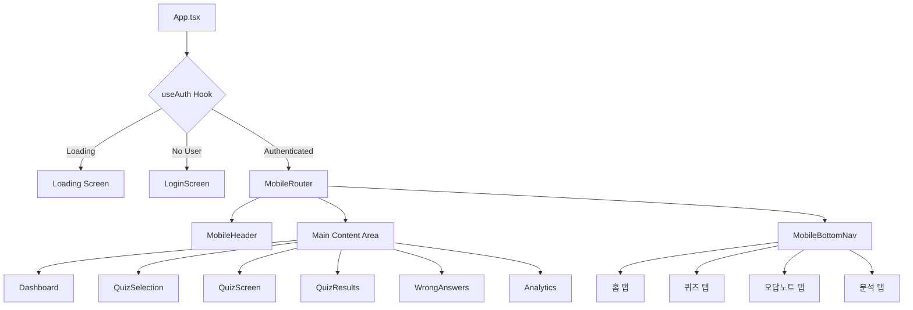
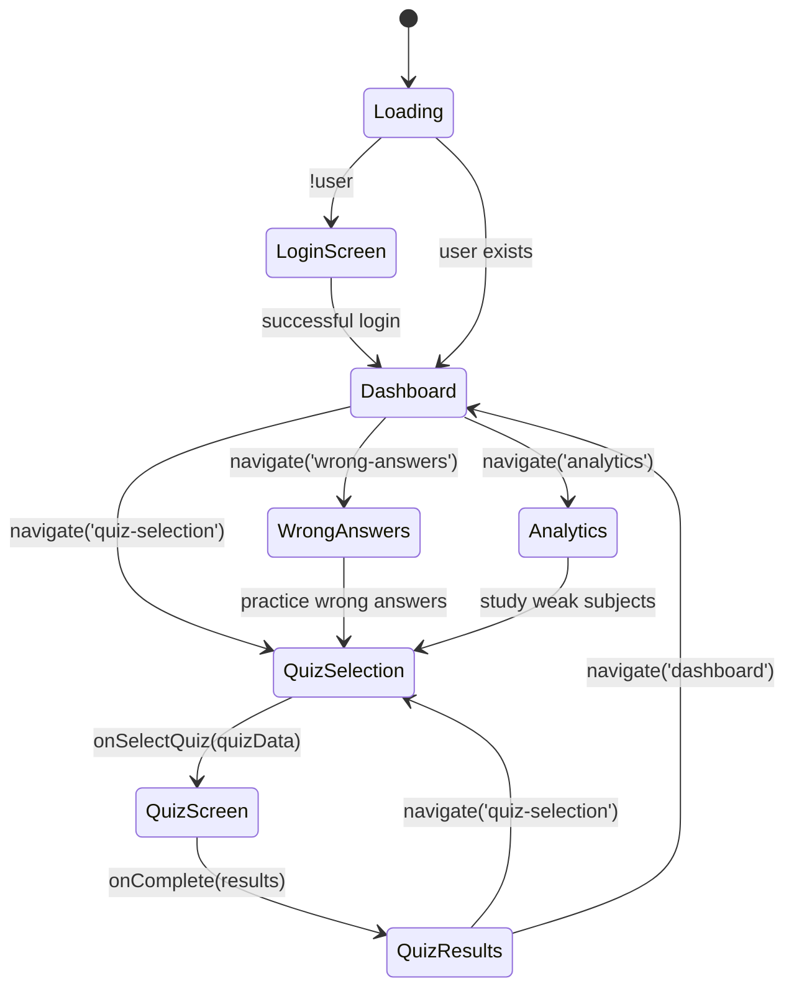
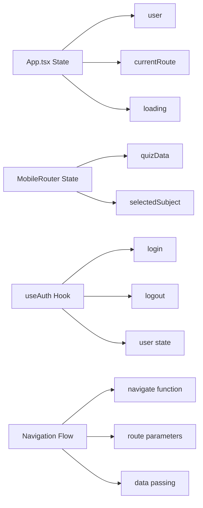
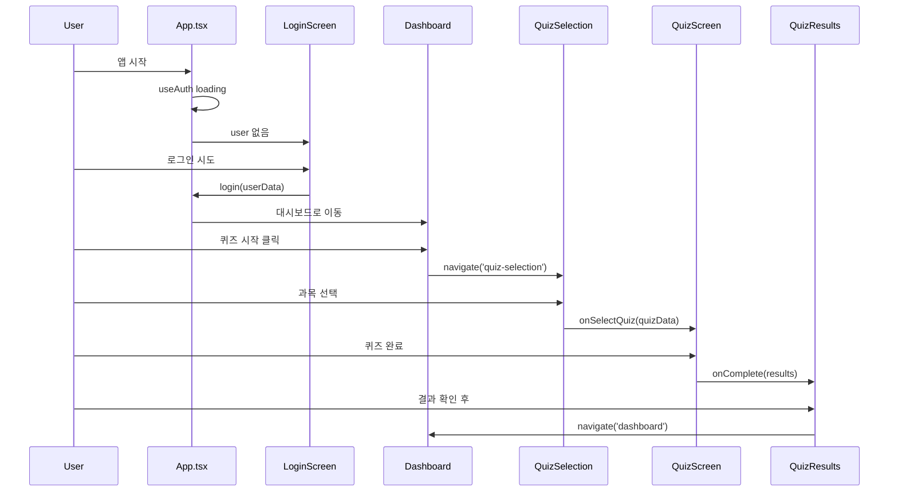
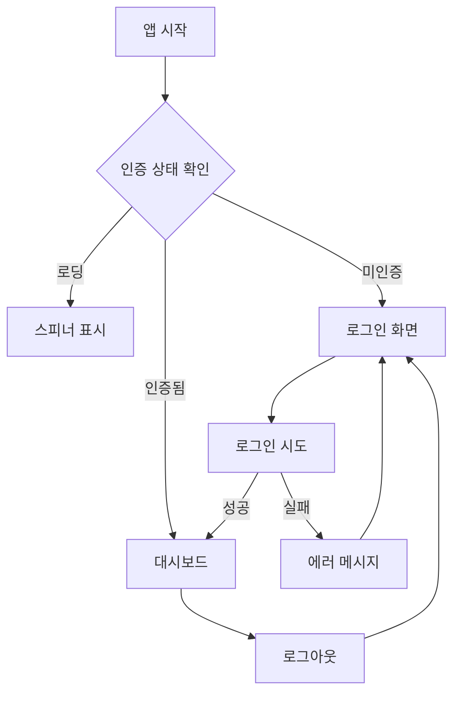

# 📱 AML Quiz App 와이어프레임

## 🏗️ 앱 아키텍처



## 📋 라우팅 구조



## 📱 화면별 와이어프레임

### 1. 로딩 화면
```
┌─────────────────────────┐
│                         │
│                         │
│                         │
│        ⭕ 스피너         │
│                         │
│      로딩 중...         │
│                         │
│                         │
│                         │
└─────────────────────────┘
```

### 2. 로그인 화면 (LoginScreen.tsx)
```
┌─────────────────────────┐
│        AML Quiz         │
│       📚 [로고]         │
│                         │
│   TPAC 자격시험 대비     │
│     완벽한 학습도구      │
│                         │
│  ┌─────────────────┐    │
│  │ 54개 퀴즈 시스템 │    │
│  └─────────────────┘    │
│  ┌─────────────────┐    │
│  │  실시간 분석    │    │
│  └─────────────────┘    │
│                         │
│  ┌─────────────────┐    │
│  │이메일 주소 입력  │    │
│  └─────────────────┘    │
│  ┌─────────────────┐    │
│  │  비밀번호 입력  │    │
│  └─────────────────┘    │
│                         │
│  ┌─────────────────┐    │
│  │      로그인     │    │
│  └─────────────────┘    │
│  ┌─────────────────┐    │
│  │   데모 계정으로  │    │
│  │    체험하기     │    │
│  └─────────────────┘    │
└─────────────────────────┘
```

### 3. 모바일 헤더 (MobileHeader.tsx)
```
┌─────────────────────────┐ ← 60px height + safe area
│ [←] AML Quiz    [🔔][👤]│
└─────────────────────────┘
```

### 4. 메인 대시보드 (Dashboard.tsx)
```
┌─────────────────────────┐
│ [←] AML Quiz    [🔔][👤]│ ← Header
├─────────────────────────┤
│                         │
│   안녕하세요, 김민수님!   │
│   TPAC 시험 합격을      │
│   위해 노력하고 있어요   │
│                         │
│ ┌─────────┐ ┌─────────┐ │ ← Quick Stats
│ │  24회   │ │  78점   │ │
│ │ 총 세션 │ │평균점수 │ │
│ └─────────┘ └─────────┘ │
│                         │
│ ⭐ 연속 학습 7일 🔥      │ ← Study Streak
│                         │
│ ┌─────────────────┐     │ ← Main CTA
│ │▶️ 퀴즈 시작하기 │     │
│ └─────────────────┘     │
│                         │
│ 🎯 전체 진도율          │ ← Overall Progress
│ ████████░░░ 33%         │
│ 18/54 퀴즈 완료         │
│                         │
│ 🕐 최근 활동            │ ← Recent Activity
│ • 자금세탁방지법 85점    │
│ • 의심거래 신고 92점     │
│ • 고객확인제도 78점      │
│                         │
│ 📚 과목별 진도          │ ← Subject Progress
│ 🔵 자금세탁방지법 85%   │
│ 🟢 의심거래 신고 90%    │
│ 🟣 고객확인제도 72%     │
│ [전체 과목 보기]        │
│                         │
│ ┌─────────┐ ┌─────────┐ │ ← Quick Actions
│ │📝 오답  │ │📊 학습  │ │
│ │  노트   │ │  분석   │ │
│ └─────────┘ └─────────┘ │
│                         │
│ 🎯 오늘의 목표          │ ← Daily Goal
│ ████████░░ 15/20분      │
├─────────────────────────┤
│[🏠][📚][📝][📊]        │ ← Bottom Nav
└─────────────────────────┘
```

### 5. 퀴즈 선택 (QuizSelection.tsx)
```
┌─────────────────────────┐
│ [←] 퀴즈 선택     [👤]  │
├─────────────────────────┤
│ 🎯 AML 퀴즈 시스템      │
│    6과목 • 54개 퀴즈    │
│   20문제 객관식 형태     │
│                         │
│ 📋 추천 퀴즈            │
│ ┌─────────────────┐     │
│ │🔵 자금세탁방지법 ▶️│     │
│ │평균 82점 • 85% 완료  │
│ │[즐겨찾기⭐][최근📅] │
│ └─────────────────┘     │
│ ┌─────────────────┐     │
│ │🟠 고객관리      ▶️│     │
│ │평균 65점 • 40% 완료  │
│ │[개선필요⚠️]          │
│ └─────────────────┘     │
│                         │
│ 📚 전체 과목 목록       │
│ ┌─────────────────┐     │
│ │🔵 자금세탁방지법 ▶️│     │
│ │🟣 고객확인제도   ▶️│     │
│ │🟢 의심거래 신고  ▶️│     │
│ │🟠 고객관리      ▶️│     │
│ │🔴 내부통제      ▶️│     │
│ │🟦 금융감독      ▶️│     │
│ └─────────────────┘     │
│                         │
│ [🔍 검색] [🎯 필터]     │
├─────────────────────────┤
│[🏠][📚][📝][📊]        │
└─────────────────────────┘
```

### 6. 과목 상세 모달 (Subject Detail Modal)
```
┌─────────────────────────┐
│ [←] 자금세탁방지법       │
├─────────────────────────┤
│ 🔵 자금세탁방지법       │
│    평균 82점 • 85% 완료  │
│    최근 학습: 2시간 전   │
│                         │
│ 📝 유형별 퀴즈 선택      │
│                         │
│ 💡 기초 (이론 중심)     │
│ ┌─────┐┌─────┐┌─────┐  │
│ │초급 ││중급 ││고급 │  │
│ │ ✅  ││ ✅  ││ ▶️  │  │
│ │85점 ││78점 ││시작 │  │
│ │20문 ││20문 ││20문 │  │
│ └─────┘└─────┘└─────┘  │
│                         │
│ 🔧 응용 (실무 중심)     │
│ ┌─────┐┌─────┐┌─────┐  │
│ │초급 ││중급 ││고급 │  │
│ │ ✅  ││ ▶️  ││ 🔒  │  │
│ │92점 ││시작 ││잠금 │  │
│ │20문 ││20문 ││20문 │  │
│ └─────┘└─────┘└─────┘  │
│                         │
│ 🚀 심화 (종합 응용)     │
│ ┌─────┐┌─────┐┌─────┐  │
│ │초급 ││중급 ││고급 │  │
│ │ ▶️  ││ 🔒  ││ 🔒  │  │
│ │시작 ││잠금 ││잠금 │  │
│ │20문 ││20문 ││20문 │  │
│ └─────┘└─────┘└─────┘  │
│                         │
│ 📊 성과 요약            │
│ • 완료한 퀴즈: 5/9      │
│ • 평균 점수: 82점       │
│ • 취약 영역: 심화 과정  │
└─────────────────────────┘
```

### 7. 퀴즈 진행 화면 (QuizScreen.tsx) - 풀스크린
```
┌─────────────────────────┐
│ [←] 퀴즈     [🔖][⏱️]│
├─────────────────────────┤
│ 자금세탁방지법 • 기초 • 중급│
│ 문제 3/20 • 15% 완료    │
│ ████░░░░░░░░░░░         │
│                         │
│ ❓ 문제 3               │
│ 자금세탁방지법상 고객확인 │
│ 의무를 이행해야 하는     │
│ 거래 기준 금액은?       │
│                         │
│ ⭕ A. 300만원 이상       │
│ ⚪ B. 500만원 이상       │
│ ⚪ C. 1000만원 이상      │
│ ⚪ D. 3000만원 이상      │
│ ⚪ E. 5000만원 이상      │
│                         │
│ ┌─────────────────┐     │
│ │    답안 제출     │     │
│ └─────────────────┘     │
│                         │
│ ┌─────────────────┐     │
│ │   이전 문제     │     │
│ └─────────────────┘     │
│                         │
│ 🔔 제한시간 없음        │
│ 📚 북마크 가능          │
│ 🔍 해설 제공            │
└─────────────────────────┘
```

### 8. 정답 확인 화면 (Answer Review)
```
┌─────────────────────────┐
│ [←] 퀴즈     [🔖][⏱️]│
├─────────────────────────┤
│ ✅ 정답입니다!          │
│    +5점 획득            │
│                         │
│ 정답: C. 1000만원 이상   │
│ 당신의 답안: C          │
│                         │
│ 💡 해설                │
│ 자금세탁방지법 제4조에    │
│ 따라 1000만원 이상의     │
│ 거래 시 고객확인의무가   │
│ 발생합니다. 이는 금융    │
│ 기관의 핵심 의무사항     │
│ 중 하나입니다.          │
│                         │
│ 📚 관련 법조문          │
│ • 자금세탁방지법 제4조   │
│ • 시행령 제7조          │
│                         │
│ ┌─────────────────┐     │
│ │    다음 문제     │     │
│ └─────────────────┘     │
│                         │
│ [🔖 북마크] [📝 메모]   │
└─────────────────────────┘
```

### 9. 퀴즈 결과 화면 (QuizResults.tsx) - 풀스크린
```
┌─────────────────────────┐
│        🏆 퀴즈 결과     │
├─────────────────────────┤
│                         │
│         🎉              │
│    최종 점수: 85점      │
│       [우수 등급]       │
│                         │
│ 📊 상세 결과            │
│ • 정답: 17개 (85%)      │
│ • 오답: 3개 (15%)       │
│ • 소요시간: 25분        │
│ • 평균 응답시간: 1.2분   │
│                         │
│ 📋 문제별 결과 검토      │
│ ┌─────────────────┐     │
│ │✅ Q1  A ➤ A  ✓   │     │
│ │✅ Q2  C ➤ C  ✓   │     │
│ │❌ Q3  B ➤ C  ✗   │     │
│ │✅ Q4  D ➤ D  ✓   │     │
│ │❌ Q5  A ➤ B  ✗   │     │
│ │... 더보기 [▼]    │     │
│ └─────────────────┘     │
│                         │
│ ⚠️ 개선 제안             │
│ • 오답 노트 3개 추가됨   │
│ • 고객확인제도 복습 권장  │
│ • 실무사례 학습 필요     │
│                         │
│ ┌─────┐┌─────┐┌─────┐  │
│ │다시 ││다른 ││홈으로│  │
│ │풀기 ││퀴즈 ││돌아가│  │
│ └─────┘└─────┘└─────┘  │
└─────────────────────────┘
```

### 10. 오답 노트 (WrongAnswers.tsx)
```
┌─────────────────────────┐
│ [←] 오답 노트     [👤]  │
├─────────────────────────┤
│ 📊 오답 현황 요약       │
│ ┌─────┐┌─────┐┌─────┐  │
│ │ 49  ││ 12  ││  8  │  │
│ │총오답││즐찾 ││미복습│  │
│ └─────┘└─────┘└─────┘  │
│                         │
│ 🎯 과목별 오답 분포      │
│ 🔴 내부통제     15개 ⚠️  │
│ 🟦 금융감독     12개     │
│ 🔵 자금세탁방지법 8개    │
│ 🟠 고객관리      7개     │
│ 🟢 의심거래신고   4개     │
│ 🟣 고객확인제도   3개     │
│                         │
│ 🔍 [검색] [📅날짜] [📂과목]│
│                         │
│ 📝 오답 문제 목록        │
│ ┌─────────────────┐     │
│ │🔵 자금세탁방지법 • 기초 │
│ │고객확인의무 거래기준은? │
│ │❌ B.500만원            │
│ │✅ C.1000만원 (정답)    │
│ │📅 2일 전 • 3회 틀림    │
│ │[⭐즐찾][👁️보기][🔄재시도]│
│ └─────────────────┘     │
│ ┌─────────────────┐     │
│ │🔴 내부통제 • 심화      │
│ │임직원 교육 주기는?     │
│ │❌ A.분기별             │
│ │✅ B.연1회이상 (정답)   │
│ │📅 3일 전 • 2회 틀림    │
│ │[📝메모][🔄재시도][📚해설]│
│ └─────────────────┘     │
│                         │
│ ┌─────────────────┐     │
│ │   오답만 모아서      │
│ │    퀴즈 풀기        │
│ └─────────────────┘     │
├─────────────────────────┤
│[🏠][📚][📝][📊]        │
└─────────────────────────┘
```

### 11. 학습 분석 (Analytics.tsx)
```
┌─────────────────────────┐
│ [←] 학습 분석     [👤]  │
├─────────────────────────┤
│ 📊 학습 통계 요약       │
│ ┌─────┐┌─────┐┌─────┐  │
│ │2.5h ││ 24  ││ 78점│  │
│ │학습 ││세션 ││평균 │  │
│ │시간 ││수   ││점수 │  │
│ └─────┘└─────┘└─────┘  │
│                         │
│ [📈전체][📚과목][🎯패턴][💡개선]│
│                         │
│ 🎯 주간 학습 목표        │
│ ████████░░ 87% 달성     │
│ 156분 / 180분 목표      │
│                         │
│ 📈 주간 점수 추이        │
│ ┌─────────────────┐     │
│ │  85    92       │     │
│ │    88    78  85 │     │
│ │82          72   │     │
│ │월 화 수 목 금 토 일│     │
│ └─────────────────┘     │
│                         │
│ 📚 과목별 성과 분석      │
│ 🟢 의심거래 ████████▓ 90%│
│ 🔵 자금세탁 ████████░ 85%│
│ 🟣 고객확인 ██████░░░ 72%│
│ 🟠 고객관리 █████░░░░ 65%│
│ 🔴 내부통제 ████░░░░░ 45%│
│ 🟦 금융감독 ███░░░░░░ 30%│
│                         │
│ 🎯 학습 패턴 분석        │
│ • 오전 학습 효과 좋음    │
│ • 주말 집중도 높음       │
│ • 연속 학습 7일째 🔥     │
│                         │
│ 💡 개선 제안            │
│ • 내부통제 집중 학습     │
│ • 금융감독 기초 보강     │
│ • 실무사례 활용 권장     │
├─────────────────────────┤
│[🏠][📚][📝][📊]        │
└─────────────────────────┘
```

### 12. 모바일 하단 네비게이션 (MobileBottomNav.tsx)
```
┌─────────────────────────┐ ← 80px height + safe area
│ [🏠] [📚] [📝] [📊]    │
│ 홈   퀴즈  오답  분석    │
└─────────────────────────┘
```

## 🗂️ 컴포넌트 상태 관리



## 🎨 디자인 시스템

### 색상 체계
```css
--subject-1: #3b82f6  /* Blue - 자금세탁방지법 */
--subject-2: #8b5cf6  /* Purple - 고객확인제도 */
--subject-3: #10b981  /* Green - 의심거래 */
--subject-4: #f59e0b  /* Orange - 고객관리 */
--subject-5: #ef4444  /* Red - 내부통제 */
--subject-6: #6366f1  /* Indigo - 금융감독 */

--difficulty-easy: #10b981    /* Green - 초급 */
--difficulty-medium: #f59e0b  /* Yellow - 중급 */
--difficulty-hard: #ef4444    /* Red - 고급 */
```

### 모바일 최적화 사이즈
```css
--mobile-header-height: 60px
--mobile-bottom-nav-height: 80px
--mobile-touch-target: 48px (최소)
--mobile-font-size: 16px (기본)
--mobile-radius: 0.75rem
```

### 반응형 브레이크포인트
- 모바일: ~768px
- 갤럭시 S25+: ~430px (최적화)
- Safe Area 고려: env(safe-area-inset-*)

## 🔄 데이터 흐름



## 📱 모바일 UX 특성

### 터치 인터랙션
- 최소 48px 터치 타겟
- 스와이프 제스처 지원
- 햅틱 피드백 고려

### 네비게이션 패턴
- 하단 탭 네비게이션 (primary)
- 상단 헤더 뒤로가기 (secondary)
- 풀스크린 모달 (quiz, results)

### 성능 최적화
- 컴포넌트 lazy loading
- 이미지 최적화
- 스크롤 성능 개선
- 터치 반응성 최적화

## 🔐 인증 플로우



이 와이어프레임은 현재 구현된 코드 구조를 정확히 반영하며, 실제 컴포넌트 간의 상호작용과 데이터 흐름을 보여줍니다.